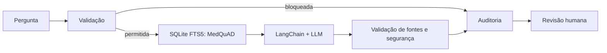

# MedAssist - Tech Challenge Fase 3

O MedAssist permite consultar informações médicas do MedQuAD e revisar respostas acompanhadas das fontes utilizadas. A aplicação combina busca textual, modelos de linguagem e validação de respostas, com uma interface em Streamlit e registro das consultas em SQLite.

As respostas são rascunhos educacionais sujeitos a revisão médica. A base contém informações públicas do MedQuAD; não inclui prontuários de pacientes ou protocolos hospitalares.

## Preparação do ambiente

Use Python 3.12 com suporte a SQLite FTS5. Na raiz do repositório, crie o ambiente virtual:

```bash
python3.12 -m venv .venv
source .venv/bin/activate
python -m pip install -r requirements.txt
```

No Windows, use `py -3.12 -m venv .venv` e ative com `.venv\Scripts\Activate.ps1`. Se a ativação estiver bloqueada, execute os comandos usando `.venv\Scripts\python.exe` no lugar de `python`.

Copie `.env.example` para `.env` se ainda não tiver esse arquivo e preencha `OPENAI_API_KEY`. A aplicação também aceita `OPEN_AI_API_KEY` ou `OPEN_AI_API`. `OPENAI_MODEL` é opcional; o padrão é `gpt-5-nano`. O `.gitignore` exclui as credenciais, o ambiente virtual, caches e os dados gerados localmente.

## Preparação dos dados

Antes da primeira execução, prepare os dados e o índice de busca:

```bash
python -m medical.dataset --limit 100
python -m medical.store
```

O primeiro comando baixa o MedQuAD e requer internet. O segundo cria `data/hospital.db`. Não é necessário repetir esses passos a cada abertura da aplicação.

## Executar

```bash
python -m streamlit run app.py --server.address 127.0.0.1 --browser.gatherUsageStats false
```

Acesse `http://localhost:8501` e faça uma pergunta médica educacional. A resposta mostra até três fontes, passa por validação e pode ser aprovada ou rejeitada por um revisor. As consultas ao modelo remoto exigem uma chave com acesso à API e saldo disponível.

## Componentes

| Componente | Implementação |
|---|---|
| Dataset | MedQuAD, com limpeza, deduplicação e divisão por tópico |
| Fine-tuning | LoRA local em SmolLM2-135M-Instruct; pipeline remoto alternativo também está presente |
| LangChain | `ChatPromptTemplate` → LLM → `StrOutputParser` |
| LangGraph | grafo: validar → recuperar → gerar → validar → finalizar |
| Base estruturada | SQLite FTS5/BM25 para documentos MedQuAD e auditoria |
| Segurança | bloqueio de prescrição/doses, limite de entrada, validação de fontes e retenção de saída incompleta |
| Logs | tabela SQLite `audit`, com evento, fontes, tokens, latência, hashes e revisão |
| Rastreabilidade | referências `[F1]` a `[F3]` ligadas aos documentos e URLs do MedQuAD |

## Operação local

O banco usa WAL, timeout de 10 segundos, chaves estrangeiras, índices para auditoria/fila e permissão de arquivo `0600`. A consulta tem intervalo de cinco segundos por sessão para evitar reenvios acidentais à API. A interface inclui fila persistente de revisões e a trilha de auditoria de cada consulta.



## Dados e treinamento

`python -m medical.dataset --limit 100` baixa o MedQuAD oficial, remove HTML, respostas vazias e perguntas duplicadas. Os tópicos são separados em treino, validação e teste antes da amostragem; somente treino é indexado no RAG. O manifesto em `data/processed/manifest.json` registra contagens, hash e seed.

O adaptador local usa LoRA com `SmolLM2-135M-Instruct`. O treinamento está configurado para uma época, com r=8 nas projeções `q_proj` e `v_proj`. O script calcula a loss antes e depois do ajuste; essa métrica mede previsão de texto, não segurança ou qualidade clínica.

Para usar o adaptador local ou executar treinamento, instale as dependências adicionais:

```bash
python -m pip install -r requirements-training.txt
```

O primeiro uso baixa o modelo-base do Hugging Face. Com o adaptador em `data/adapter`, basta ativar **Usar modelo com fine-tuning** na interface; esse modo não requer chave da OpenAI. Para um novo treinamento, com os dados preparados, execute:

```bash
python -m medical.local_training
```

O script preserva adaptadores existentes e interrompe a execução se `data/adapter/adapter_config.json` já estiver presente. As métricas de uma nova execução são gravadas em `docs/local_training.json`.

Na interface, a opção **Usar modelo com fine-tuning** ativa o adaptador disponível. O modelo local é experimental e responde principalmente em inglês. O padrão da aplicação é `gpt-5-nano`. O pipeline remoto alternativo está em `medical/finetune.py`, configurado para `gpt-4.1-nano` e sujeito à disponibilidade de treinamento na conta.

## Validação

```bash
python -m unittest discover -s tests -v
python -m pip check
```

Os quatro testes verificam curadoria do XML, ausência de vazamento entre grupos, segurança, validação de citações, auditoria/revisão e carregamento da interface. Eles usam respostas simuladas, sem chamadas pagas à API. Prepare os dados antes de executá-los para incluir a verificação da separação dos grupos.

## Estrutura

- `app.py`: interface de consulta e fila de revisão;
- `medical`: preparação de dados, busca, geração de respostas, segurança, treinamento e avaliação;
- `data/processed`: dados preparados e manifesto;
- `data/adapter`: adaptador LoRA local;
- `data/hospital.db`: documentos indexados, auditoria e revisões;
- `tests`: testes automatizados.

## Limitações

- MedQuAD é informação pública em inglês, não protocolo hospitalar.
- A busca usa FTS5/BM25; não há embeddings ou base vetorial.
- A base não contém dados de pacientes ou contexto clínico individual.
- Não há autenticação profissional, criptografia em repouso ou validação clínica.
- Respostas são rascunhos educacionais; não prescrevem, diagnosticam ou executam ações clínicas.

Uma implantação hospitalar exigiria autenticação, criptografia, controle de acesso e validação clínica institucional.

A integração com prontuários e protocolos depende de fontes autorizadas, dados anonimizados e controles específicos para o tratamento dessas informações.
