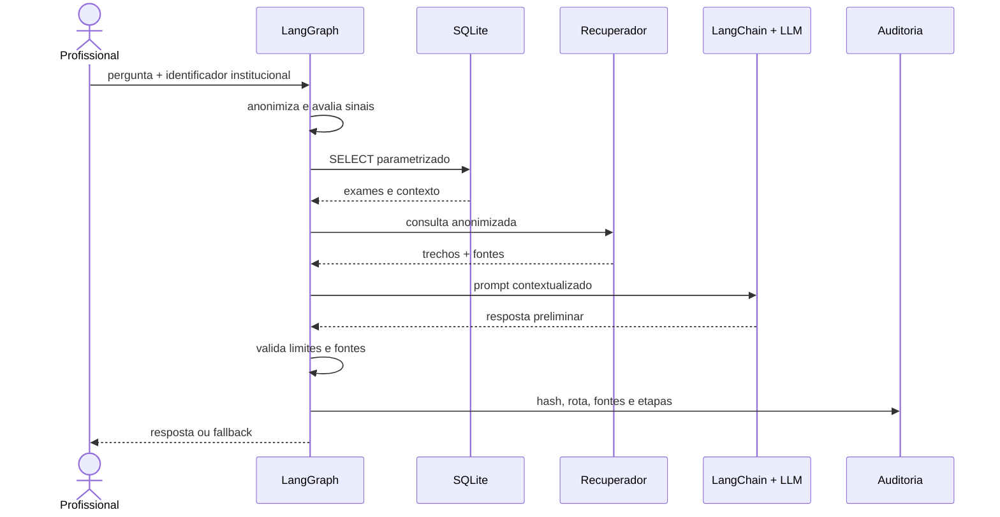

# Arquitetura e contratos

## Componentes

| Componente | Entrada | Saída | Responsabilidade |
|---|---|---|---|
| Anonimizador | texto livre | texto e contagens | remover identificadores diretos |
| Repositório clínico | `patient_id` validado | contexto estruturado | executar consultas somente leitura |
| Recuperador | pergunta e contexto | protocolos ranqueados | fornecer evidência e metadados |
| Gerador | prompt contextualizado | resposta preliminar | organizar a linguagem |
| Validador | resposta e fontes | decisão e motivos | aplicar limites verificáveis |
| Grafo | pergunta e `patient_id` | estado final | coordenar nós e rotas |
| Auditoria | estado final | registro JSONL | preservar rastreabilidade operacional |

## Sequência

## Estado compartilhado

O `AssistantState` preserva dados necessários entre os nós. `question` existe apenas em memória durante a execução. O log recebe somente seu hash SHA-256.

| Campo | Conteúdo |
|---|---|
| `anonymized_question` | pergunta após remoção de identificadores |
| `patient_context` | resumo retornado por consultas definidas |
| `pending_exams` | nome e data de solicitação |
| `sources` | código, título, trecho, caminho e relevância |
| `critical` / `alerts` | resultado das regras de priorização |
| `output_valid` | decisão da validação de saída |
| `route` | resposta validada ou bloqueio |
| `steps` | histórico operacional legível |
