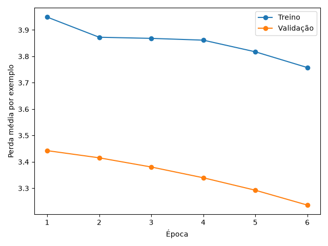
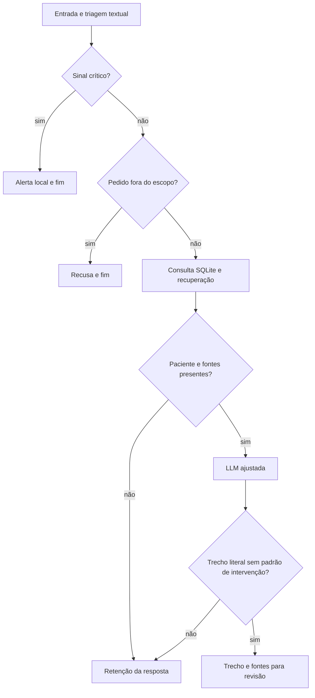

# Assistente clínico institucional: ajuste fino e orquestração com revisão profissional

## Resumo

Foi desenvolvido um protótipo com dados sintéticos para estudar adaptação de um modelo de linguagem, consulta estruturada, recuperação documental e orquestração por grafo. O experimento executou LoRA em FLAN-T5-small e comparou o modelo base com o adaptador. A perda de teste diminuiu, mas as respostas permaneceram insuficientes para apoio clínico. O fluxo implementa retenção conservadora de saídas e priorização de alertas antes da geração. Os resultados distinguem aprendizado estatístico, funcionamento do software e validade clínica.

## 1. Objetivo e fundamentação

O objetivo é organizar informações de prontuário e protocolos para revisão por um profissional. O sistema não altera registros nem executa condutas.

O projeto combina duas formas de uso dos documentos. No ajuste fino, exemplos de instrução, contexto e resposta orientam a atualização de um adaptador LoRA, enquanto os pesos originais do modelo permanecem congelados. Na inferência, a recuperação seleciona trechos de protocolos e os inclui no contexto da pergunta. Treinar o adaptador e recuperar documentos são processos distintos: o primeiro modifica parâmetros; o segundo fornece informações para uma execução específica.

O FLAN-T5-small transforma uma sequência de entrada em uma sequência de resposta. O LangChain encadeia a montagem do prompt e a chamada do modelo. O LangGraph coordena as etapas e suas decisões por meio de um estado compartilhado, permitindo encerrar o processamento antes da geração quando há alerta, recusa ou ausência de contexto.

A recuperação lexical foi escolhida para a coleção de quatro protocolos por permitir inspecionar a contribuição dos termos e executar a busca localmente com baixo custo computacional. Ela não usa embeddings semânticos: depende da sobreposição de palavras entre pergunta e documentos, o que limita o tratamento de sinônimos. As seções seguintes detalham a preparação dos dados, o treinamento, a recuperação e os controles de saída.

## 2. Dados e curadoria

O corpus contém 25 exemplos sintéticos em cinco categorias: FAQ, protocolos, registros, procedimentos e segurança. Há quatro protocolos sintéticos, três pacientes e sete exames. Um exemplo de reconciliação e receita contém campos de preenchimento exclusivo do profissional. Não há doses ou medicamentos propostos pelo assistente nesse modelo.

As fontes REGRA e MODELO identificam exemplos de treinamento; os documentos PROTO constituem a coleção recuperável. Não se deve interpretar uma etiqueta de origem como comprovação de referência clínica publicada. Os protocolos são fictícios e não passaram por validação médica.

A preparação verifica campos, identificadores únicos, entradas duplicadas e comprimento mínimo da resposta. Expressões regulares removem padrões conhecidos de identificação. O detector usa os mesmos tipos de padrões, incluindo nomes rotulados; portanto, sua avaliação não é independente e não comprova anonimização irreversível. Nomes sem rótulos e combinações indiretas podem permanecer. A ausência de dados reais é uma condição do experimento.

### 2.1 Partições

Foram definidos 15 exemplos de treino, cinco de validação e cinco de teste, com identificadores disjuntos. Todas as categorias aparecem nas três partições. REC-007, que contém o modelo de receita, integra o conjunto de treino.

A divisão fixa facilita reprodução, mas não é amostragem aleatória nem teste de protocolos inéditos. Os conjuntos compartilham o domínio institucional. Com somente cinco exemplos de teste, os indicadores são descritivos e não sustentam inferência estatística sobre desempenho assistencial.

O treino atualiza pesos; a validação seleciona a época; o teste compara os resultados após a seleção. Respostas do modelo base são registradas para comparação, sem orientar a escolha de hiperparâmetros. Os hashes dos arquivos identificam a versão exata usada.

## 3. Treinamento

### 3.1 Escolha do modelo

O ambiente inspecionado possui aproximadamente 6 GB de RAM e vídeo integrado AMD, sem CUDA. O perfil local usa FLAN-T5-small, da família T5, com adaptação LoRA. O modelo é pequeno e não foi escolhido como solução clínica de qualidade comprovada. O objetivo é executar e avaliar o processo nas condições disponíveis.

O treinamento usa CPU em precisão float32, sem quantização. O uso do modelo base permanece sujeito à sua licença; o treinamento do adaptador não altera essas condições. Os pesos do adaptador são locais e não estão incluídos no Git.

### 3.2 Processo

T5 recebe a entrada pelo codificador e prevê a resposta no decodificador. A função `format_prompt` é compartilhada por treino e inferência. A tokenização converte o texto em identificadores numéricos reconhecidos pelo modelo. Durante o treinamento, a perda de entropia cruzada penaliza previsões que atribuem baixa probabilidade aos tokens da resposta esperada. O programa verifica os comprimentos antes de treinar, evitando truncamento silencioso.

LoRA mantém a matriz original congelada e aprende uma atualização de baixo posto, W' = W + (alpha/r) BA. Nessa expressão, W representa os pesos originais, A e B são as matrizes treináveis, r determina o posto da atualização e alpha controla sua escala. Essa decomposição reduz o número de parâmetros ajustados. Usam-se as projeções de consulta (q) e valor (v) dos mecanismos de atenção, posto 8, alpha 16 e dropout 0,05. O dropout desativa aleatoriamente parte das ativações durante o treinamento como forma de regularização. O experimento atualizou 344.064 parâmetros entre 77.305.216 parâmetros totais, cerca de 0,45%.

| Parâmetro | Configuração local |
|---|---|
| Precisão | float32, sem quantização |
| Épocas | 6 |
| Taxa de aprendizado | 0,0002 |
| Otimizador | AdamW |
| Lote e acumulação | um exemplo; até quatro gradientes |
| Norma máxima do gradiente | 1 |
| Semente | 42 |
| Seleção | menor perda de validação |
| Limites verificados | 512 tokens de entrada; 256 de alvo |
| Geração | determinística, até 160 tokens novos |

Os valores foram definidos antes da avaliação final, sem busca exaustiva. A acumulação reduz memória; o último grupo usa seu tamanho real. O adaptador com menor perda de validação é salvo e recarregado antes da comparação final.

### 3.3 Resultados da LLM

A perda média de validação caiu de 3,4425 na primeira época para 3,2361 na sexta. A sexta época foi selecionada.

| Indicador no teste, n=5 | Modelo base | Adaptador |
|---|---:|---:|
| Perda média por exemplo | 3,3887 | 3,1454 |
| Recall lexical médio | 0,0133 | 0,0239 |

A perda é a média das perdas por exemplo, não uma média ponderada pelo total de tokens. A perda de treino inclui dropout e pesos em atualização; a validação usa modo de avaliação.

A queda da perda indica melhor ajuste aos alvos sob essa métrica. Entretanto, a qualidade gerativa continua baixa. Em PRO-004, o modelo repete a instrução em vez de explicar os limites. Em FAQ-006, reproduz partes do prompt. Em SEC-004, a saída adaptada apresenta repetição prolongada e mistura de idiomas. Não há evidência de utilidade clínica.

As respostas completas, versões, revisão do modelo, comprimentos, hashes e histórico estão em [training.json](results/training.json). O recall lexical é a fração de termos únicos da referência presentes na resposta; não mede equivalência semântica, factualidade ou correção médica.

## 4. Integração e recuperação

A consulta SQLite usa identificador validado e comandos SELECT parametrizados em modo somente leitura. Retorna condições, alergias, exames pendentes e resultados. A leitura é feita a cada execução; os dados de demonstração continuam estáticos e fictícios.

A recuperação usa TF-IDF: cada termo recebe um peso correspondente à sua frequência relativa no texto multiplicada pelo IDF suavizado, log((1+N)/(1+df))+1. N é o número de documentos e df é o número de documentos que contêm o termo. Termos presentes em menos documentos recebem maior peso relativo. A similaridade cosseno compara a direção dos vetores de pesos da pergunta e de cada documento, ordenando os resultados pela proximidade lexical. Somente a pergunta participa da consulta: comorbidades não devem produzir evidências artificiais para assuntos ausentes do corpus.

Selecionam-se até dois documentos com pontuação mínima de 0,08. Esse valor é uma configuração inicial, não confiança estatística. A seção com mais termos em comum é limitada a 700 caracteres. Isso pode perder conteúdo relevante e não resolve sinonímia. Código, título, versão e caminho relativo à raiz do projeto acompanham a fonte; a pontuação não demonstra suporte factual.

A chain usa Runnable para compor o prompt e invocar o adaptador real. O gerador determinístico é restrito aos testes de software. O contexto tem limite explícito de tokens na inferência.

### 4.1 Contratos entre componentes

| Componente | Entrada | Resultado |
|---|---|---|
| Triagem | pergunta tratada | alerta, recusa ou continuação |
| SQLite | identificador sintético validado | dados atuais da base local |
| Recuperação | pergunta | até dois protocolos e metadados |
| LangChain | pergunta e evidências | prompt compartilhado com o treinamento |
| Modelo | prompt | rascunho experimental |
| Verificador | rascunho e contexto | trecho literal ou retenção |
| Auditoria | estado, inclusive falhas | metadados sem texto clínico livre |

O estado acumula as etapas concluídas. `TypedDict` descreve sua estrutura; as funções verificam o conteúdo. A configuração `demo` usa um gerador determinístico para testes; `t5` carrega o modelo base e o adaptador treinado.

## 5. Grafo e segurança

A triagem é anterior à geração. Alertas e recusas não dependem da obediência da LLM. A detecção trata ordem dos sintomas e algumas negações locais; não interpreta toda a linguagem clínica. O sistema não envia notificações externas.

O rascunho só é disponibilizado se corresponder literalmente ao contexto e não contiver padrões de intervenção. A medida reduz o espaço de saídas admitidas, mas pode bloquear paráfrases adequadas. Também não prova que um trecho literal seja apropriado ao caso. Toda saída informa que nenhuma conduta foi autorizada. Não existe uma etapa de aprovação médica eletrônica.

A ausência de paciente ou fontes interrompe a geração. Falhas operacionais são propagadas e registradas. A rota de alerta encerra o fluxo antes das verificações de geração, preservando a mensagem de triagem.

## 6. Auditoria e testes

Cada execução registra identificador único, backend, duração, etapas, rota, fontes com versão e tipo de erro. Texto livre de pergunta, rascunho e resposta não é persistido no log. Hashes de valores previsíveis não são proteção irreversível; o armazenamento é apenas local e experimental.

A suíte contém 19 testes, incluindo integridade das partições, cobertura do modelo de receita, leitura parametrizada, falta de paciente, triagem antes da LLM, falta de contexto e auditoria de falhas. Os testes usam bases temporárias e não recriam a base da aplicação.

A avaliação integrada com T5 inclui cinco casos. O pedido clínico normal foi retido pela verificação literal; os demais exercitam alerta, recusa, assunto sem cobertura e paciente ausente. As rotas e respostas estão em [system.json](results/system.json). O funcionamento desses controles não transforma o resultado gerativo negativo em sucesso clínico.

Os notebooks foram organizados para mostrar código, resultado e interpretação. O segundo lê evidência salva por padrão; a repetição do treinamento é explícita. Os comandos completos estão no README.

## 7. Limitações

Amostra pequena, corpus sintético, ausência de avaliação por especialistas, baixa qualidade em português, regras textuais incompletas e recuperação lexical restringem o alcance das conclusões. A correspondência literal é uma política de retenção, não explicabilidade causal da LLM.

A reprodutibilidade depende de bibliotecas, modelo e dados. Versões e revisão do modelo estão registradas, mas execução em outro hardware pode produzir pequenas diferenças. Não houve avaliação prospectiva, integração hospitalar ou comparação estatística abrangente.

## 8. Conclusão

Foi realizado um ajuste LoRA reproduzível e demonstrada a integração com consulta estruturada, recuperação e grafo. O resultado principal combina viabilidade técnica com desempenho gerativo insuficiente. A avaliação expõe essa limitação e justifica a retenção de saídas, preservando a distinção entre um experimento acadêmico executado e um assistente apto ao uso clínico.
