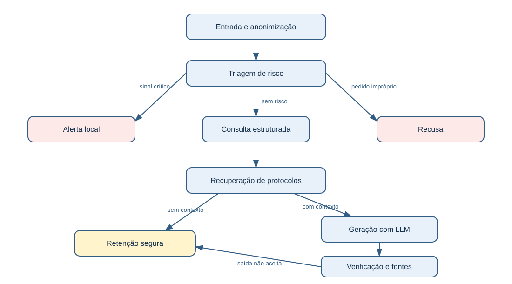

# Relatório técnico: assistente clínico institucional

## 1. Finalidade

O protótipo organiza informações clínicas sintéticas para revisão profissional. Ele foi estruturado para mostrar como um modelo de linguagem pode ser ajustado e inserido em um fluxo controlado, sem assumir decisões médicas. A aplicação não altera registros, não prescreve e não emite comunicações externas.

O processamento separa tarefas que têm responsabilidades diferentes. A base estruturada fornece dados do paciente; a recuperação encontra protocolos relacionados; o modelo gera um rascunho a partir desse contexto; e o grafo controla quais situações podem chegar à geração e quais devem ser interrompidas antes dela.

## 2. Dados e preparação

O corpus possui 25 exemplos sintéticos distribuídos em cinco grupos: perguntas frequentes, protocolos, registros e laudos, procedimentos e segurança. Há também quatro protocolos em arquivos Markdown, três pacientes e sete exames em CSV. Os exemplos foram escritos para representar documentos institucionais sem reproduzir informações de pessoas reais.

O script `scripts/prepare_data.py` executa a curadoria. Primeiro, verifica a presença dos campos necessários e a unicidade dos identificadores. Em seguida, aplica padrões de anonimização a instrução, contexto e resposta. O processo interrompe a execução se restar um formato direto de identificação, se houver entradas duplicadas ou se uma resposta for curta demais para o treinamento.

Depois da validação, a preparação cria três conjuntos sem identificadores em comum: treino, validação e teste. O conjunto de treino atualiza o adaptador. O conjunto de validação é usado para escolher a época com menor perda. O conjunto de teste é usado somente após essa escolha, para comparar o modelo base com o adaptador selecionado. A divisão fixa facilita repetir o experimento nas mesmas condições.

A anonimização é limitada: padrões regulares identificam formatos conhecidos, mas não conseguem garantir que toda informação indireta ou todo nome livre tenha sido removido. Como os dados são sintéticos, essa etapa demonstra o mecanismo de controle e não uma certificação de anonimização.

## 3. Ajuste fino do modelo

O treinamento usa FLAN-T5-small, um modelo de geração de texto formado por codificador e decodificador. A entrada contém uma instrução, uma pergunta e as evidências disponíveis. A saída esperada é o texto de referência associado ao exemplo.

O ajuste é realizado com LoRA. Em vez de alterar todos os pesos do modelo base, LoRA adiciona pequenas matrizes treináveis a projeções do mecanismo de atenção. Essa escolha reduz a quantidade de parâmetros atualizados e torna o treinamento possível em CPU. O programa verifica os tamanhos dos textos antes do treinamento para evitar perda silenciosa de conteúdo por truncamento.

O treinamento executa seis épocas, registra as perdas de treino e validação e salva o melhor adaptador em `models/clinical-t5-lora`. Também produz um arquivo de resultados contendo versões das bibliotecas, identificadores das partições, comparações entre respostas e métricas descritivas. Esses resultados são locais e devem ser regenerados a cada execução.

Uma redução de perda não significa que a resposta seja clinicamente adequada. A avaliação qualitativa observa se o modelo repete o prompt, mistura idiomas, omite limites ou produz conteúdo sem apoio no contexto. Essas verificações são mais importantes que uma métrica isolada para decidir se uma saída deve ser retida.

## 4. Assistente com contexto atualizado

O módulo `data_access.py` acessa o SQLite com consultas parametrizadas e apenas de leitura. Para um identificador de paciente válido, ele reúne condições, alergias, exames pendentes e resultados existentes. A aplicação lê a base em cada execução, portanto utiliza o estado atual daquele arquivo local.

O módulo `retrieval.py` carrega os protocolos e cria uma representação TF-IDF. Cada documento recebe pesos para seus termos; palavras frequentes em um único documento tendem a distinguir melhor esse documento do que palavras presentes em todos eles. A similaridade cosseno ordena os protocolos de acordo com as palavras compartilhadas com a pergunta. A aplicação conserva, no máximo, duas fontes acima de um limiar mínimo e registra código, título, versão e caminho relativo de cada uma.

O LangChain une pergunta, dados do paciente e trechos recuperados em um único prompt. O mesmo contrato textual é utilizado na preparação do treinamento e na inferência. A LLM não gera comandos SQL nem escolhe sozinha quais dados escrever no banco.

## 5. Fluxo LangGraph e controles

O grafo começa anonimizando a pergunta e procurando sinais textuais críticos. Quando há sinal crítico, o fluxo emite um alerta local e termina antes de carregar o modelo. Quando a pergunta solicita diagnóstico, prescrição, dose ou alteração terapêutica, a aplicação recusa a solicitação por código e também encerra o fluxo.

Nas demais situações, o grafo consulta o paciente e procura protocolos. Sem paciente ou fontes, a geração não ocorre. Com contexto suficiente, o LangChain chama a LLM e o resultado é tratado como rascunho. A etapa final só aceita um trecho que tenha correspondência literal com as evidências e que não contenha padrões de intervenção. Caso contrário, a resposta é retida.

Essa regra é deliberadamente conservadora. Ela reduz o risco de disponibilizar texto inventado, mas pode reter respostas adequadas escritas com outras palavras. Uma coincidência literal também não comprova que o conteúdo seja apropriado ao caso. Por isso toda saída reforça a necessidade de revisão profissional.

Cada chamada gera um registro de auditoria com identificador da execução, duração, etapas concluídas, rota tomada, fontes e eventuais erros. Perguntas, rascunhos e respostas em texto livre não são gravados no log. O registro favorece o rastreamento do funcionamento, mas não substitui controles de acesso, autenticação ou governança de dados.

## 6. Avaliação

A avaliação separa três aspectos: o comportamento do modelo base e do adaptador, a qualidade textual dos rascunhos e o funcionamento das regras do sistema. As comparações de respostas mostram se o treinamento alterou o comportamento gerativo; elas não constituem validação clínica.

Os testes automatizados verificam a separação das partições, a permanência do modelo de receita no treino, a leitura parametrizada do banco, a recuperação de protocolos, a interrupção de alertas antes da LLM, a recusa de solicitações impróprias, o bloqueio por falta de contexto e o registro de falhas na auditoria.

O script `scripts/evaluate_system.py` executa casos integrados: uma pergunta contextualizada, um alerta, uma recusa, um assunto sem fonte e um paciente inexistente. A avaliação registra as rotas tomadas e permite conferir que alerta e recusa não dependem da resposta gerada pelo modelo.

## 7. Limitações e conclusão

O projeto é um experimento técnico com corpus reduzido e sintético. Ele não foi avaliado por especialistas, não mede desempenho em uso real e não deve ser aplicado ao cuidado de pacientes. A recuperação lexical não compreende sinônimos com segurança, e a LLM pode produzir texto inadequado mesmo quando recebe contexto.

Apesar dessas limitações, a implementação demonstra um processo completo: preparação e curadoria de dados, ajuste fino local, consulta estruturada, recuperação de fontes, geração contextualizada, fluxo de segurança, rastreabilidade e testes. A retenção de respostas sem suporte e a separação entre geração e decisão clínica são elementos centrais do desenho do protótipo.
