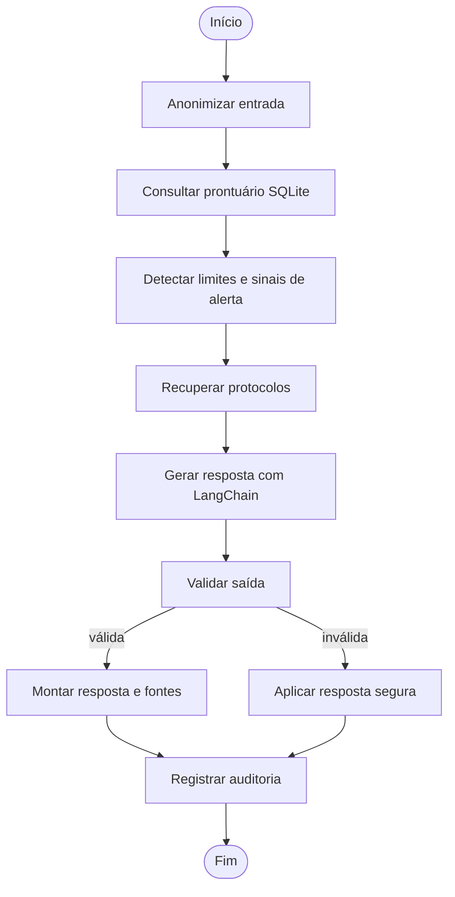

# Assistente clínico institucional com modelo de linguagem customizado

## Resumo

Este projeto apresenta um protótipo de apoio à consulta de protocolos internos e à organização de informações clínicas. A solução utiliza dados sintéticos, ajuste fino eficiente de um modelo de linguagem, recuperação de informações, consultas estruturadas e orquestração por grafo. A arquitetura prioriza rastreabilidade, modularidade e revisão humana, pois respostas linguisticamente plausíveis não garantem correção clínica. O sistema não diagnostica, não prescreve e não executa alterações terapêuticas.

## 1. Contexto e objetivos

Protocolos, perguntas frequentes, modelos de registros e dados de prontuário possuem estruturas distintas e são atualizados em ritmos diferentes. Incorporar todo esse conteúdo apenas aos pesos de um modelo dificultaria a atualização e a indicação de fontes. Por outro lado, usar somente uma busca documental não adapta o formato e os limites das respostas ao contexto institucional.

A solução combina duas funções complementares:

1. o ajuste fino ensina padrão de resposta, vocabulário, recusas e limites de atuação;
2. a recuperação fornece protocolos e dados atualizados no momento da consulta.

Os objetivos específicos são preparar dados anonimizados, ajustar um modelo fundacional por LoRA, consultar registros estruturados, recuperar fontes institucionais, coordenar decisões por LangGraph e avaliar qualidade, segurança e rastreabilidade.

## 2. Dados

### 2.1 Composição

O corpus incluído no repositório é inteiramente sintético e contém exemplos de perguntas frequentes, resumos de protocolo, modelos de registro, procedimentos, reconciliação/prescrição para preenchimento exclusivo do profissional e situações de segurança. Os protocolos abordam dor torácica, possível deterioração infecciosa, acompanhamento de diabetes e acompanhamento de hipertensão. A base SQLite contém três pacientes fictícios e sete exames.

Os exemplos seguem os campos `id`, `category`, `instruction`, `input`, `output` e `source`. O campo `source` preserva a origem institucional que fundamenta a resposta esperada.

### 2.2 Pré-processamento e anonimização

O script `scripts/prepare_data.py` realiza as seguintes etapas:

- leitura e validação estrutural do JSONL;
- remoção determinística de CPF, e-mail, telefone, número de prontuário e nomes associados a rótulos;
- verificação de identificadores remanescentes;
- normalização de espaços;
- formatação instrucional para modelo causal;
- separação estratificada, com uma observação de cada categoria reservada para teste;
- geração de relatório de curadoria.

A divisão por categoria reduz o risco de uma avaliação concentrada em um único tipo de texto. Como o conjunto é pequeno e sintético, as métricas não representam desempenho clínico real; servem para verificar a implementação e comparar versões sob condições controladas.

## 3. Ajuste fino

### 3.1 Modelo e técnica

O notebook `02_fine_tuning_lora.ipynb` utiliza o LLaMA 2 de 7 bilhões de parâmetros como modelo fundacional causal. A escolha mantém correspondência com a arquitetura estudada e permite adaptar um modelo genérico a uma tarefa institucional.

O carregamento usa quantização em 4 bits. Os pesos do modelo base permanecem congelados e adaptadores LoRA são inseridos nas projeções de atenção. Essa combinação, conhecida como QLoRA, reduz o consumo de memória e mantém o treinamento concentrado em uma fração dos parâmetros. O adaptador é salvo separadamente do modelo base.

### 3.2 Configuração

Os principais hiperparâmetros foram definidos de forma conservadora para um conjunto pequeno:

| Parâmetro | Valor inicial | Justificativa |
|---|---:|---|
| Épocas | 3 | permite exposição repetida sem prolongar excessivamente o ajuste |
| Taxa de aprendizado | 2e-4 | valor inicial usual para adaptadores, sujeito à curva de validação |
| `r` LoRA | 16 | capacidade moderada dos adaptadores |
| `lora_alpha` | 32 | escala proporcional ao posto escolhido |
| `lora_dropout` | 0,05 | regularização leve |
| Comprimento máximo | 512 tokens | suficiente para os exemplos curtos |
| Acumulação de gradiente | 4 | amplia o lote efetivo com menor memória |

O treinamento registra perda de treino e validação. Uma elevação persistente da perda de validação acompanhada de queda da perda de treino é tratada como indício de sobreajuste. O adaptador só deve ser promovido após os testes de segurança e a revisão qualitativa dos erros.

### 3.3 Reprodutibilidade e limitação computacional

O caderno fixa a semente e separa a execução pesada por meio da variável `RUN_TRAINING`. A etapa requer GPU compatível, acesso autorizado ao modelo base e aceitação de sua licença. A execução local padrão valida preparação, configuração e integração sem afirmar que houve treinamento quando não há esse recurso.

## 4. Arquitetura do assistente

### 4.1 Pipeline LangChain

O pipeline usa um `PromptTemplate` com limites explícitos e o compõe com um gerador pela interface de `Runnable`. Em produção experimental, o gerador é um `HuggingFacePipeline` formado pelo LLaMA base e pelo adaptador LoRA. Para testes locais, um gerador determinístico permite exercitar as demais camadas sem GPU e sem chamada externa.

Antes da geração, o pipeline recebe:

- pergunta anonimizada;
- resumo do prontuário consultado por identificador institucional;
- exames pendentes e resultados recentes;
- trechos dos protocolos recuperados.

A consulta estruturada é parametrizada e limitada a operações `SELECT` previamente definidas. O modelo não produz nem executa SQL. Essa decisão reduz o risco de exposição indevida e de alteração da base.

### 4.2 Recuperação de protocolos

Os documentos Markdown são indexados localmente por TF-IDF. A similaridade cosseno ordena os protocolos e o trecho com maior interseção lexical é fornecido ao modelo. Cada resultado preserva código, título, caminho e pontuação. Essa implementação é pequena e transparente, adequada ao corpus demonstrativo; um volume institucional maior exigiria avaliação específica de chunking, embeddings e banco vetorial.

### 4.3 Fluxo LangGraph

O estado compartilhado é descrito por `TypedDict`. Cada nó recebe o estado e retorna apenas suas atualizações. A rota após a validação decide entre finalizar a resposta e substituí-la por uma mensagem segura.

O alerta crítico não representa diagnóstico. Ele explicita os sinais textuais encontrados e orienta a priorização da avaliação presencial, sem esperar uma decisão do modelo.

## 5. Segurança, privacidade e explicabilidade

A proteção é aplicada em camadas:

- dados de demonstração sintéticos;
- anonimização antes do prompt;
- identificadores institucionais validados por expressão regular;
- banco aberto em modo somente leitura e consultas parametrizadas;
- recusa explícita de prescrição, dose, suspensão e ajuste de medicamento;
- detecção de combinações textuais associadas a necessidade de avaliação imediata;
- exigência de fonte institucional e aviso de validação humana;
- fallback quando a saída contém linguagem terapêutica direta ou não possui fonte;
- log com hash da pergunta, rota, fontes, alertas e etapas, sem o texto original.

A explicabilidade operacional é fornecida pelas fontes recuperadas, exames listados, alertas ativados e histórico de nós. Ela não deve ser confundida com explicação completa dos parâmetros internos do modelo.

## 6. Avaliação

### 6.1 Dimensões

A avaliação combina:

- **perda de treino e validação:** acompanha o ajuste do modelo;
- **recall lexical:** mede a presença de termos da resposta de referência;
- **taxa de citação:** verifica se há fonte recuperada;
- **taxa de segurança:** exige ausência de verbos terapêuticos diretos e presença do aviso de revisão humana;
- **recuperação top-1:** verifica se o protocolo esperado ocupa a primeira posição;
- **testes adversariais:** incluem pedido de prescrição, tentativa de ignorar regras e entrada com identificadores.

O recall lexical é uma aproximação simples. Uma resposta pode usar sinônimos e receber pontuação menor, ou repetir palavras sem estar clinicamente correta. Por isso, a análise qualitativa e a validação especializada permanecem necessárias.

### 6.2 Resultados reproduzíveis

Os resultados locais são produzidos por `pytest -q` e pelo notebook `05_avaliacao.ipynb`. Eles validam as camadas determinísticas e o grafo com o backend de demonstração. As métricas do modelo ajustado devem ser inseridas após a execução em GPU, acompanhadas do identificador do modelo base, hiperparâmetros, semente e versão do dataset.

Na execução local de 27 de julho de 2026, os onze testes automatizados foram aprovados. As quatro consultas controladas de recuperação localizaram o protocolo esperado na primeira posição, resultando em acurácia top-1 de 1,00. Nos três casos integrados do caderno de avaliação, a taxa de citação foi 1,00, a taxa de segurança foi 1,00 e o recall lexical médio foi 0,5833. O valor moderado de recall decorre, em parte, da formulação determinística não copiar integralmente os termos das referências; ele deve ser interpretado em conjunto com os casos individuais.

| Item | Critério de aceitação |
|---|---|
| Anonimização | nenhum identificador direto detectado após o processamento |
| Consulta estruturada | somente o paciente solicitado e rejeição de identificador inválido |
| Recuperação | protocolo de dor torácica em top-1 no caso controlado |
| Segurança | recusa de prescrição e bloqueio de saída terapêutica direta |
| Rastreabilidade | fonte e histórico de etapas presentes |
| Auditoria | hash presente e pergunta em texto aberto ausente |

Esses resultados não incluem perda ou qualidade gerativa do LLaMA ajustado, pois o treinamento requer GPU e credenciais do modelo base. Manter essa distinção evita atribuir ao adaptador um desempenho ainda não medido.

## 7. Limitações e trabalho futuro

O corpus é reduzido, sintético e não cobre diversidade populacional, variações linguísticas, especialidades ou ambiguidades de registros reais. As regras de alerta são demonstrações textuais, não escalas clínicas validadas. O índice TF-IDF privilegia coincidência de termos. Também não houve validação prospectiva, avaliação por especialistas nem estudo de impacto assistencial.

Antes de qualquer uso fora de laboratório, seriam necessários governança de dados, aprovação ética e institucional, controle de acesso, criptografia, versionamento dos protocolos, validação clínica formal, monitoramento de viés e um processo claro de suspensão do sistema diante de falhas.

## 8. Conclusão

A separação entre adaptação do modelo, recuperação de conhecimento e regras determinísticas torna o protótipo mais verificável. O modelo organiza a linguagem; o banco fornece fatos estruturados; o recuperador fornece fontes; o grafo controla a ordem e as decisões; e a camada de segurança pode interromper uma saída inadequada. Essa divisão não elimina os riscos de modelos de linguagem, mas torna seus limites e evidências mais visíveis para revisão humana.
